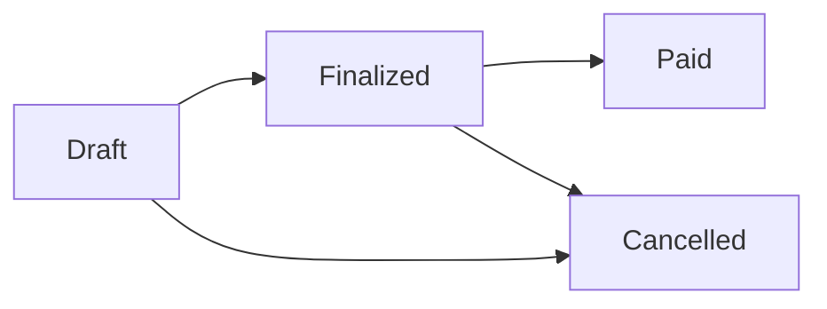

# 📋 Invoice Management System - Business Rules Documentation

## 🎯 Overview

This document outlines all business rules, calculations, workflows, and validation logic for the Invoice Management System. These rules ensure data integrity, proper financial calculations, and compliance with Indonesian business practices.

---

## 👥 User Roles & Permissions

### 🔑 Role Hierarchy

#### Admin
**Full System Access**
- ✅ User management (create, edit, delete, change roles)
- ✅ System settings and configuration
- ✅ All CRUD operations on all entities
- ✅ Delete operations (soft delete with audit trail)
- ✅ Financial reporting and analytics
- ✅ Data import/export
- ✅ Bank account management
- ✅ Invoice status management (draft → finalized → paid)

#### Finance Supervisor
**Operations Management**
- ❌ User management (cannot create/delete users)
- ❌ System settings modification
- ✅ All CRUD operations except delete
- ✅ Mark invoices as paid/unpaid
- ✅ Full reporting and export capabilities
- ✅ Invoice approval workflow
- ✅ Financial oversight
- ✅ Company and TKA worker management
- ✅ Job descriptions management

#### Finance Staff
**Data Entry & Basic Operations**
- ❌ User management
- ❌ System settings
- ❌ Delete operations
- ❌ Mark invoices as paid
- ✅ Invoice creation and editing (draft only)
- ✅ Company and TKA worker management
- ✅ Job descriptions management
- ✅ Basic reporting (view only)
- ✅ Data entry operations

### 🚫 Access Control Rules

1. **Data Isolation**: Users can only see data they created or have permission to access
2. **Operation Restrictions**: Each role has specific operation limitations
3. **Audit Trail**: All actions are logged with user ID and timestamp
4. **Session Management**: Token-based authentication with role validation

---

## 💰 Invoice Calculation Rules

### 📊 VAT (PPN) Calculation - Special Business Rule

**Critical Custom Rounding Logic:**

```typescript
// Special VAT rounding rules for Indonesian business compliance
function calculateVAT(subtotal: number, vatPercentage: number = 11): number {
    const vatAmount = (subtotal * vatPercentage) / 100
    const fractional = vatAmount - Math.floor(vatAmount)
    
    // Special case: .49 rounds DOWN
    if (Math.abs(fractional - 0.49) < 0.001) {
        return Math.floor(vatAmount)
    }
    // Special case: .50 and above rounds UP  
    else if (fractional >= 0.50) {
        return Math.ceil(vatAmount)
    }
    // Standard mathematical rounding for other cases
    else {
        return Math.round(vatAmount)
    }
}
```

**Examples:**
- Subtotal: Rp 18.000.000 → VAT: Rp 1.980.000,49 → **Rounded to: Rp 1.980.000**
- Subtotal: Rp 18.181.818 → VAT: Rp 1.999.999,98 → **Rounded to: Rp 2.000.000**
- Subtotal: Rp 18.181.819 → VAT: Rp 2.000.000,09 → **Rounded to: Rp 2.000.000**

### 🧮 Line Item Calculations

1. **Line Total**: `Unit Price × Quantity`
2. **Subtotal**: Sum of all line totals
3. **VAT Amount**: Calculated using special rounding rules
4. **Grand Total**: `Subtotal + VAT Amount`

### 💱 Currency Rules

- All amounts stored as DECIMAL(15,2)
- Minimum amount: Rp 0.01
- Maximum amount: Rp 999,999,999,999.99
- Display format: Indonesian Rupiah (IDR) with thousands separators
- Input validation: Numeric only, max 2 decimal places

---

## 🔢 Invoice Numbering System

### 📋 Numbering Format

**Pattern**: `INV-YY-MM-NNN`

**Components:**
- `INV`: Fixed prefix (configurable in settings)
- `YY`: Last 2 digits of year
- `MM`: Month with leading zero (01-12)  
- `NNN`: Sequential number with leading zeros (001-999)

**Examples:**
- `INV-24-12-001` (First invoice of December 2024)
- `INV-25-01-078` (78th invoice of January 2025)

### 🔄 Number Generation Rules

1. **Monthly Reset**: Sequential numbers reset to 001 each month
2. **Auto-increment**: Next number automatically generated
3. **Gap Prevention**: No gaps in sequence within same month
4. **Manual Override**: Users can edit invoice number before finalization
5. **Duplicate Prevention**: System validates uniqueness before save
6. **Rollback Safety**: Failed transactions don't consume numbers

### 🗄️ Sequence Management

```sql
-- Invoice sequence table structure
CREATE TABLE invoice_sequences (
    year INTEGER NOT NULL,
    month INTEGER NOT NULL,
    current_number INTEGER NOT NULL DEFAULT 0,
    prefix VARCHAR(10) DEFAULT 'INV',
    UNIQUE (year, month)
);
```

---

## 📄 Invoice Status Workflow

### 🔄 Status Transitions



### 📋 Status Rules

#### Draft Status
- ✅ Can be edited freely
- ✅ Can add/remove line items
- ✅ Can change all invoice details
- ✅ Can be deleted
- ✅ Auto-save every 30 seconds
- ❌ Cannot be printed officially
- ❌ Not included in financial reports

#### Finalized Status  
- ✅ Can be printed and exported
- ✅ Included in financial reports
- ✅ Can be marked as paid (Finance Supervisor only)
- ✅ Can still be edited (with audit trail)
- ❌ Cannot be deleted
- ❌ Number cannot be changed

#### Paid Status
- ✅ Read-only for Finance Staff
- ✅ Can be edited by Finance Supervisor/Admin
- ✅ Included in paid reports
- ✅ Full audit trail maintained
- ❌ Cannot be deleted
- ❌ Cannot revert to draft

#### Cancelled Status
- ✅ Archived state
- ✅ Visible in reports with cancelled flag
- ❌ Cannot be edited
- ❌ Cannot be printed
- ❌ Cannot transition to other states

---

## 👷 TKA Worker Management

### 📝 Worker Registration Rules

1. **Passport Uniqueness**: Each passport number must be unique globally
2. **Name Validation**: Minimum 2 characters, maximum 100 characters
3. **Gender Options**: "Laki-laki" or "Perempuan" only
4. **Division Optional**: Free text field for organizational grouping
5. **Soft Delete**: Workers marked inactive instead of deleted

### 👨‍👩‍👧‍👦 Family Member Rules

1. **Relationship Types**: 
   - `spouse` - Husband/wife
   - `parent` - Father/mother  
   - `child` - Son/daughter

2. **Pricing Inheritance**: Family members inherit same pricing as main TKA worker

3. **Assignment Rules**: Family members automatically inherit company assignments

4. **Passport Uniqueness**: Family member passports must also be globally unique

### 🔄 TKA-Company Assignment

1. **Flexible Assignment**: Any TKA can be assigned to any company
2. **Historical Tracking**: Track all past assignments for reporting
3. **Multiple Companies**: TKA can work for multiple companies
4. **Invoice Validation**: TKA must have worked for company to appear on invoice

---

## 🏢 Company Management

### 📋 Company Registration Rules

1. **NPWP Validation**: 
   - Must be exactly 15 digits
   - Must be unique across all companies
   - Format: 123456789012345

2. **IDTKU Uniqueness**: Each company must have unique IDTKU

3. **Required Fields**:
   - Company name (2-200 characters)
   - NPWP (15 digits)
   - IDTKU (1-20 characters)
   - Address (minimum 10 characters)

4. **Optional Fields**:
   - Contact phone
   - Contact email

### 💼 Job Description Rules

1. **Company Association**: Each job description belongs to one company
2. **Pricing Flexibility**: Same job can have different prices per company
3. **Custom Pricing**: Invoice line items can override default job price
4. **Active Status**: Inactive jobs don't appear in invoice creation
5. **Sort Order**: Jobs can be ordered for consistent display

---

## 🧾 Invoice Line Items & Baris System

### 📊 Baris Grouping Logic

**What is Baris?**
Baris is a grouping mechanism allowing multiple job descriptions to share the same line number on printed invoices.

**Rules:**
1. **Manual Grouping**: Users can assign same baris number to multiple line items
2. **Auto-increment**: If no baris specified, auto-assign next available number
3. **Print Grouping**: Lines with same baris number grouped on printed invoice
4. **Flexible Ordering**: Line order independent of baris number

**Example:**
```
Baris 1: Software Development (TKA: John)
Baris 1: Code Review (TKA: John)  
Baris 2: System Administration (TKA: Jane)
Baris 3: Database Design (TKA: Bob)
Baris 3: Database Migration (TKA: Bob)
```

### 💰 Custom Pricing Rules

1. **Job Override**: Line items can override default job description price
2. **Custom Jobs**: Create ad-hoc job descriptions with custom pricing
3. **Validation**: Custom prices must be ≥ 0.01
4. **Audit Trail**: Track price changes with user and timestamp

### 🔢 Quantity Rules

1. **Minimum**: 1 unit per line item
2. **Maximum**: 9,999 units per line item
3. **Calculation**: Line total = Unit price × Quantity
4. **Validation**: Must be positive integer

---

## 🖨️ PDF Generation & Printing

### 📄 PDF Layout Rules

#### Header Section
- Company logo area (if available)
- "INVOICE" title (centered, bold)
- "Spirit of Services" tagline
- Invoice number, date, place (Jakarta)
- Page numbering

#### Recipient Information
- Company name
- Full address (multi-line support)
- NPWP display

#### Invoice Table
- Columns: No, Date, Expatriate, Description, Amount
- Baris grouping display (show number only on first line of group)
- Auto-page handling for long invoices
- Currency formatting (Indonesian Rupiah)

#### Totals Section
- Subtotal
- VAT percentage and amount
- Grand total (bold)
- Terbilang (amount in words)

#### Footer (Last Page Only)
- Bank account details
- Signature area for authorized person
- Office address information

### 🖨️ Printing Rules

1. **Print Tracking**: Count and timestamp each print
2. **Status Requirement**: Only finalized invoices can be printed officially
3. **Draft Printing**: Draft invoices can be printed with "DRAFT" watermark
4. **Dot Matrix Support**: Formatted for Epson LX-300 via Electron
5. **Copy Management**: Track number of copies printed

---

## 🏦 Bank Account Management

### 🔧 Configuration Rules

1. **Default Bank**: Only one bank can be marked as default
2. **Active Status**: Inactive banks don't appear in invoice creation
3. **Required Fields**:
   - Bank name
   - Account number
   - Account name

4. **Invoice Association**: Invoices can specify which bank account to display

### 📋 Display Rules

1. **PDF Display**: Bank details appear only on last page
2. **Selection**: Users can choose bank per invoice
3. **Default Selection**: Default bank auto-selected for new invoices

---

## 🔍 Search & Filtering

### 🎯 Smart Search Rules

#### Multi-field Search
- **TKA Workers**: Name, passport, division
- **Companies**: Company name, NPWP, IDTKU
- **Invoices**: Invoice number, company name

#### Fuzzy Matching
- Typo tolerance (1-2 character differences)
- Partial word matching
- Case-insensitive search

#### Performance Rules
- Maximum 50 results per search
- 300ms debounce delay
- Result caching for 5 minutes
- Background search (non-blocking UI)

### 📊 Filtering Logic

#### Date Filters
- Inclusive date ranges
- Default to current month if no range specified
- Timezone handling (Indonesian timezone)

#### Status Filters
- Multiple status selection allowed
- Default to active records only
- Clear visual indication of applied filters

---

## 📊 Data Import/Export Rules

### 📥 Import Validation

#### Excel/CSV Import
1. **Required Columns**: Validate all required fields present
2. **Data Types**: Validate numeric, date, and text fields
3. **Unique Constraints**: Check NPWP, passport, IDTKU uniqueness
4. **Reference Integrity**: Validate foreign key relationships
5. **Batch Size**: Maximum 1000 records per import
6. **Error Reporting**: Detailed line-by-line error reports

#### Data Transformation
- Automatic data cleaning (trim whitespace, normalize formats)
- Date format standardization
- Currency value parsing
- Text encoding validation (UTF-8)

### 📤 Export Features

#### Report Generation
1. **Format Options**: Excel, PDF, CSV
2. **Date Filtering**: Flexible date range selection
3. **Company Filtering**: Single or multiple company selection
4. **Status Filtering**: Include/exclude based on invoice status

#### Export Permissions
- **Admin**: Full export access
- **Finance Supervisor**: Full export access
- **Finance Staff**: Limited export (own data only)

---

## ⚙️ System Settings & Configuration

### 🔧 Configurable Parameters

#### Invoice Settings
- VAT percentage (default: 11%)
- Invoice number prefix (default: "INV")
- Auto-save interval (default: 30 seconds)
- Print copies count (default: 2)

#### Company Settings
- Company name and address
- Default bank account
- Currency symbol and format
- Date format preferences

#### Security Settings
- Session timeout duration
- Password complexity requirements
- Login attempt limits
- Audit log retention period

### 🔄 Setting Validation

1. **VAT Percentage**: Must be between 0% and 100%
2. **Prefix Length**: Maximum 10 characters
3. **Numeric Settings**: Positive integers only
4. **Text Settings**: Maximum length validation

---

## 🔐 Security & Audit Rules

### 🛡️ Data Protection

#### Access Control
- Role-based permissions strictly enforced
- Data isolation between user levels
- Session-based authentication
- Token expiration management

#### Audit Trail
- All CRUD operations logged
- User identification tracking
- Timestamp recording (UTC)
- Change history maintenance

### 🔍 Data Integrity

#### Validation Rules
- Server-side validation for all inputs
- SQL injection prevention
- XSS protection
- CSRF token validation

#### Backup & Recovery
- Daily automated backups
- Point-in-time recovery capability
- Data export for manual backups
- Disaster recovery procedures

---

## 📋 Business Process Workflows

### 🔄 Invoice Creation Workflow

1. **Company Selection**
   - Choose existing company or create new
   - Validate company has active job descriptions
   - Load company details automatically

2. **TKA & Job Selection**
   - Select TKA worker or family member
   - Choose from company's job descriptions
   - Apply custom pricing if needed
   - Assign baris grouping

3. **Line Item Management**
   - Add multiple line items
   - Reorder items as needed
   - Validate calculations real-time
   - Preview invoice layout

4. **Finalization**
   - Validate all required fields
   - Generate final invoice number
   - Lock editing capabilities
   - Enable printing/export

### 🔄 Payment Processing Workflow

1. **Invoice Tracking**
   - Monitor payment due dates
   - Track payment status
   - Generate payment reminders

2. **Payment Recording**
   - Finance Supervisor marks as paid
   - Record payment date and method
   - Update financial reports
   - Generate payment confirmations

---

## ⚠️ Error Handling & Validation

### 🚫 Common Validation Errors

#### Data Entry Errors
- Required field missing
- Invalid format (NPWP, email, phone)
- Duplicate values (passport, NPWP)
- Out of range values (negative amounts)

#### Business Logic Errors
- TKA not assigned to company
- Invoice date in future
- Inactive company/worker selection
- Invalid status transitions

### 🔧 Error Recovery

#### Automatic Recovery
- Connection retry with exponential backoff
- Transaction rollback on errors
- Auto-save recovery for interrupted sessions
- Graceful degradation for partial failures

#### User Guidance
- Clear error messages in Indonesian and English
- Suggested corrections for common errors
- Help documentation integration
- Contact support options

---

## 📊 Performance & Scalability Rules

### ⚡ Performance Targets

#### Response Times
- Page loads: < 2 seconds
- Search results: < 500ms
- PDF generation: < 5 seconds
- Report exports: < 30 seconds

#### Scalability Limits
- Maximum 10,000 invoices per company per year
- Maximum 1,000 TKA workers per company
- Maximum 100 job descriptions per company
- Maximum 50 line items per invoice

### 🔧 Optimization Rules

#### Database Performance
- Indexed columns for frequent searches
- Query optimization for complex joins
- Connection pooling for concurrent users
- Regular maintenance and cleanup

#### UI Performance
- Pagination for large datasets
- Lazy loading for detailed views
- Debounced search inputs
- Optimistic UI updates

---

## 🌍 Localization & Regional Compliance

### 🇮🇩 Indonesian Business Compliance

#### Tax Regulations
- VAT calculation per Indonesian tax law
- NPWP format validation
- Tax reporting requirements
- Invoice numbering compliance

#### Language Support
- Indonesian primary language
- English secondary language
- Currency formatting (Rupiah)
- Date format (DD/MM/YYYY)

#### Cultural Considerations
- Indonesian naming conventions
- Business etiquette in communications
- Holiday calendar integration
- Working hours considerations

---

This comprehensive business rules documentation ensures all stakeholders understand the system's behavior, calculations, and workflows. Regular updates to this document should reflect any changes in business requirements or regulatory compliance needs.